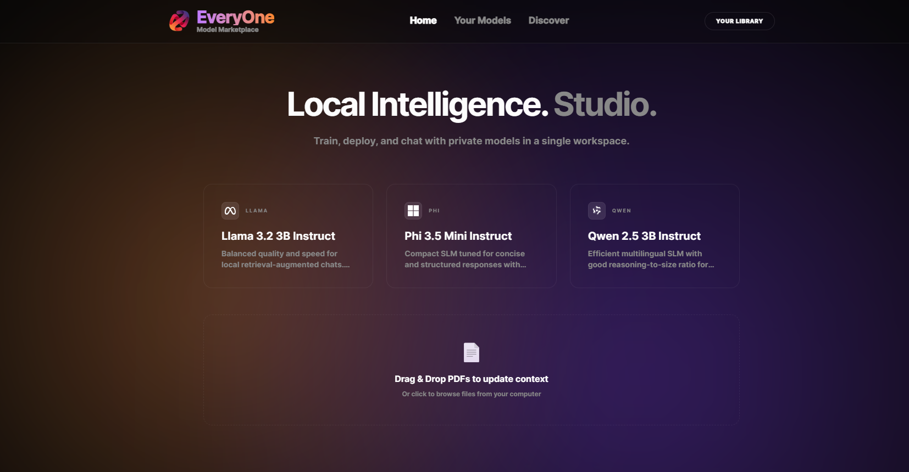

# EveryOne: Local Intelligence Studio

<p align="center">
  
</p>


**EveryOne** est une plateforme "Local-First" conçue pour démocratiser l'accès aux modèles de langage de petite taille (SLM). Ce studio permet de transformer votre machine en un centre de recherche privé capable de traiter des documents complexes via RAG (Retrieval-Augmented Generation) et d'affiner des modèles sur mesure via un pipeline hybride local/cloud. L'objectif est d'offrir une interface intuitive où la confidentialité des données est totale, tout en bénéficiant de la puissance de calcul du cloud pour l'entraînement.

---

## 🚀 Key Features

* **100% Local Inference**: Chat with GGUF models (Llama, Phi, Qwen, Mistral) downloaded to your machine for total privacy.
* **RAG & Drag-and-Drop**: Ingest your PDFs from the home page or drop them **directly into the chat window** to add them to the AI context in real-time.
* **1-Click Fine-Tuning with Real-time Polling**: Train your own models on Modal's cloud GPUs. Follow progress (0-100%) and status updates directly on the model card.
* **Advanced Chat UI**: Full Markdown support (bold, headers, lists) and explicit source citations (PDF title + page number).
* **Dynamic Management**: Download, rename, and load your fine-tuned models into memory without restarting the server.

---

## 1) Installation & Python Environment

We use a single **Python 3.10** virtual environment at the root of the project, which serves both the backend and deployment tools.

Navigate to the project root and create the virtual environment:

```bash
python3.10 -m venv .venv
```

**Activating the environment:**
* On Windows: `.\.venv\Scripts\activate`
* On Mac/Linux: `source .venv/bin/activate`

**Installing dependencies:**
While still at the project root:
```bash
pip install -r requirements.txt
```

**Starting the FastAPI backend:**
Navigate to the `backend/` folder to start the server:
```bash
cd backend
uvicorn api:app --host 127.0.0.1 --port 8000 --reload
```

---

## 2) Launching the Frontend

From the project root, install Node dependencies. To ensure all specific packages are present, we use a requirements list:

```bash
npm install
# Install specific project dependencies from the requirement list
npm install $(cat npm_requirements.txt)
npm run dev
```

By default, Vite configures a proxy from `/api` to `http://127.0.0.1:8000`.

---

## 3) Fine-Tuning Configuration (Modal)

To use the Fine-Tuning feature ("🚀 Fine-Tune Model"), you must configure Modal.

1. Create an account on [modal.com](https://modal.com) and authenticate your terminal:
   ```bash
   modal setup
   ```
2. Create a Modal secret containing your HuggingFace token:
   ```bash
   modal secret create huggingface-secret HF_TOKEN=hf_your_token_here
   ```
3. Deploy the training script:
   ```bash
   modal deploy backend/finetune.py
   ```
4. **Important**: Copy the API URL returned by Modal and update the `MODAL_URL` variable in the `/api/finetune` route within your `backend/api.py`.

---

## 📁 Local Model Architecture (GGUF)

The backend automatically scans the `backend/Model/` directory to find `.gguf` models. 

If you use the "⬇️ Download Finetuned" button from the interface, the backend will automatically retrieve the cloud-generated model and place it in this local directory.

---

## 📄 PDF Ingestion & RAG

- **Anti-duplication**: Previously indexed PDFs are detected via SHA-256 file hashing.
- **Precision**: Chunks store the original page number (`chunks.page`).
- **Transparency**: Chat responses display cited sources in dedicated UI badges.

---

## 🌐 Network Deployment

If your backend is running on a different machine (e.g., IP `10.0.0.12`):

1. **Frontend (`.env`)**:
```env
VITE_BACKEND_PROXY_TARGET=[http://10.0.0.12:8000](http://10.0.0.12:8000)
VITE_API_BASE_URL=
```

2. **Backend**:
```bash
CORS_ORIGINS=http://localhost:5173,[http://192.168.](http://192.168.)x.x:5173 uvicorn api:app --host 0.0.0.0 --port 8000
```